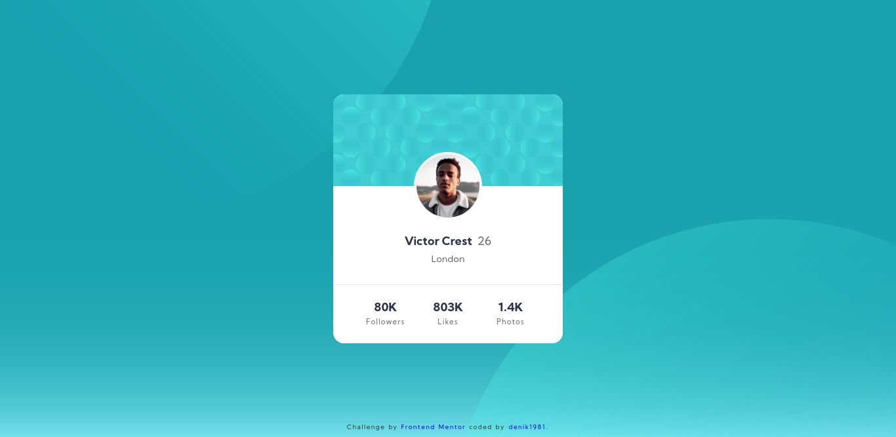

# Frontend Mentor - Profile card component solution

This is a solution to the [Profile card component](https://www.frontendmentor.io/challenges/profile-card-component-cfArpWshJ) challenge on Frontend Mentor.  
Frontend Mentor challenges help you improve your coding skills by building realistic projects.

## Table of contents

- [Frontend Mentor - Profile card component solution](#frontend-mentor---profile-card-component-solution)
  - [Table of contents](#table-of-contents)
  - [Overview](#overview)
    - [The challenge](#the-challenge)
    - [Screenshot](#screenshot)
    - [Links](#links)
  - [My process](#my-process)
    - [Built with](#built-with)
    - [What I learned](#what-i-learned)
    - [Useful resources](#useful-resources)
  - [Author](#author)
  - [Acknowledgments](#acknowledgments)

## Overview

### The challenge

- The challenge was to a build out the project to the designs provided.
- You can find the design required to complete this challenge inside the **fem** folder.

### Screenshot

### Links

- Solution URL: [Profile Card Component on FEM](https://www.frontendmentor.io/solutions/profile-card-component-sass-pug-bem-2GklPrpiJ)
- Live Site URL: [femdenik1981.vercel.app/profilecard](https://femdenik1981.vercel.app/profilecard)

## My process

- I created a basic HTML based on the qsemantics according to the desktop version of the site.
- I added the necessary extra HTML tags to help me later achieve the design provided.
- I built the CSS for the Mobile version.
- I progressively moved up to the desktop version checking if breakpoints where needed.
- I refactored the CSS using **BEM** and added more semantic to the project.
- I checked and fixed any **a11y** issue I found.

I have used **SASS** as CSS preprocessor and **PUG** as an HTML preprocessor.  
I have included a short script (build.js) to compile those source files.

### Built with

- HTML5 markup
- Flexbox
- CSS Grid
- Mobile-first workflow
- [a11y](developer.mozilla.org/en-US/docs/Web/Accessibility/ARIA) - Accesibility
- [PUG](https://pugjs.org/) - HTML Preprocessor
- [SASS](https://sass-lang.com/) - CSS Preprocessor
- [BEM](https://en.bem.info/) - CSS Methodology

### What I learned

I picked up this simple challenge to start with a small context and blend every good styling  
practices I found in a proper way.

I learned **BEM** which helps me refactor my styles so that they can become easy to mantain in  
the future.

I'm in the process of learning ARIA and the little bit I studied about it also puts me in the  
direction of keeping a good semantic narrative on my files.

### Useful resources

- [getbem.com](http://getbem.com/) - BEM, one of the most popular naming CSS patterns to help keep your CSS tied to a consistent structure.
- [Jen Simmoms - Layout Land](https://www.youtube.com/channel/UC7TizprGknbDalbHplROtag) - A great Youtube channel to learn CSS best practices.
- [Andy Bell - CUBE CSS](https://cube.fyi/) - The creator of CUBE CSS explains a new great pattern that extends from BEM.

## Author

- Frontend Mentor - [denik1981](https://www.frontendmentor.io/profile/denik1981)
- Github - [denik1981](https://github.com/denik1981)

## Acknowledgments
